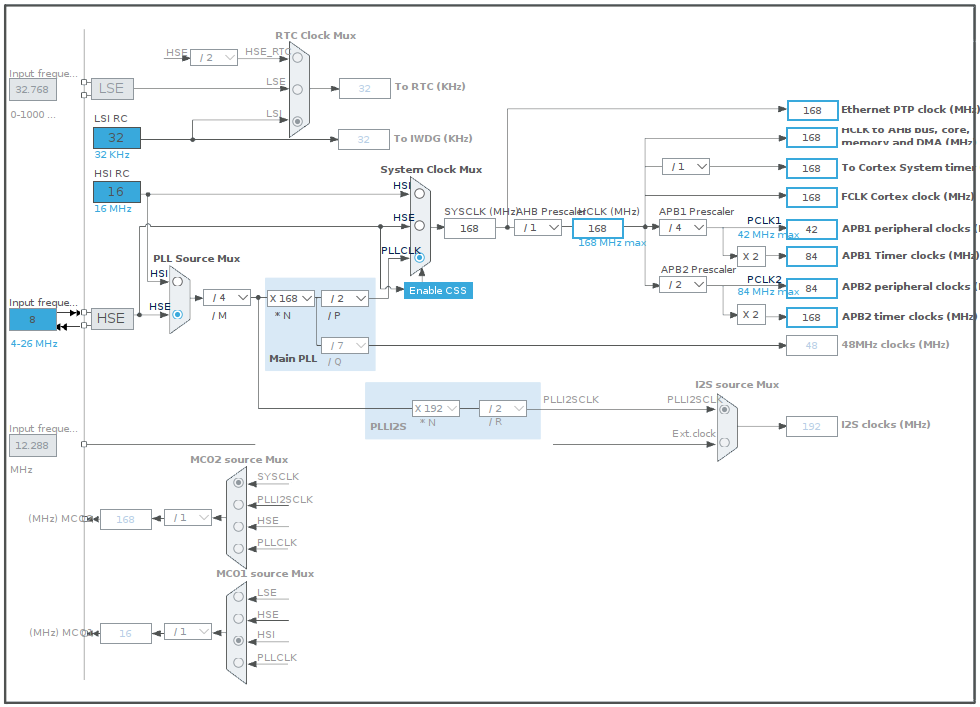
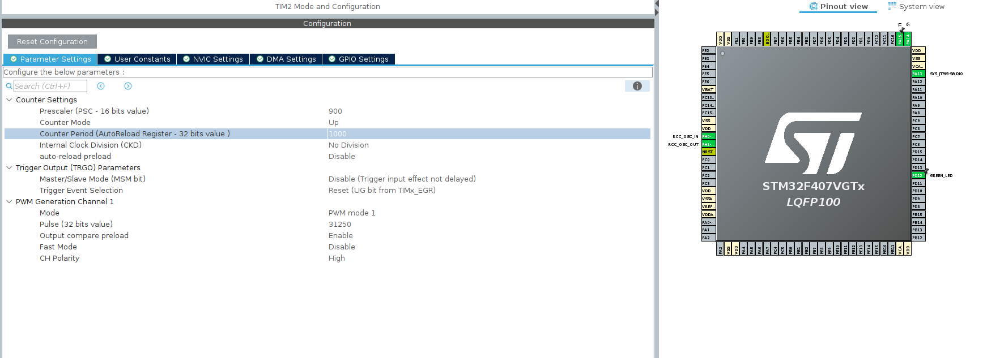

# PWM Pin Clock Configurations

In order to achieve a timer frequency of 50Hz with a 84MHz APB1 timer clock and a 42MHz APB1 peripheral clock we do the calculation below.

Here's the calculation:

Timer frequency = APB1 timer clock / (PSC + 1) / (ARR + 1)
Substituting the values: 50Hz = 84MHz / (900 + 1) / (1000 + 1)
Solving for PSC: PSC = 900
Solving for ARR: ARR = 1000

work in progress. 
