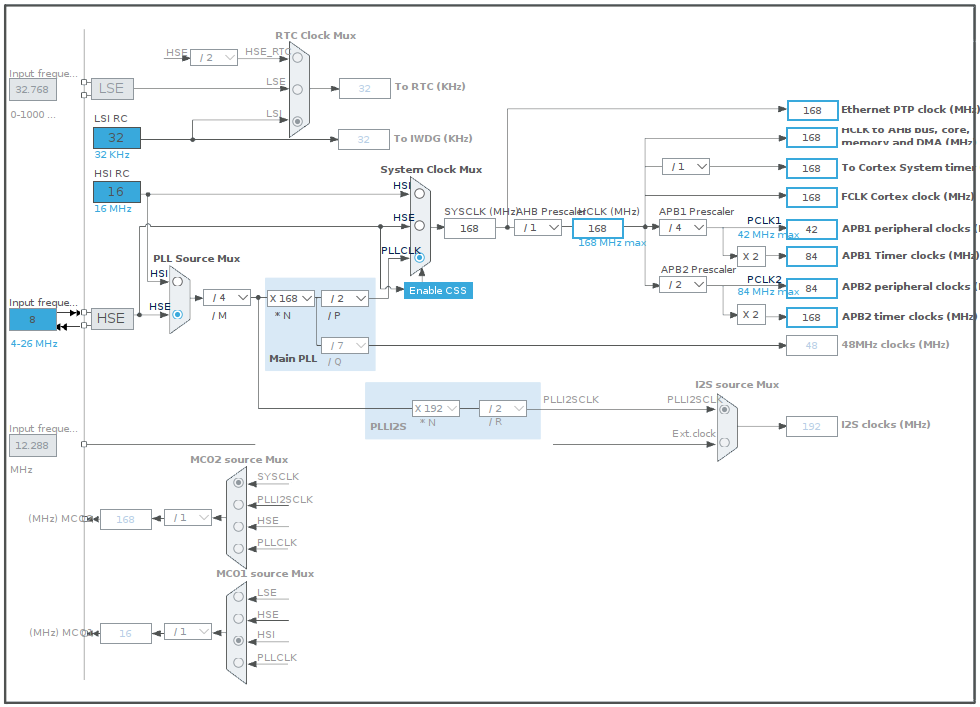
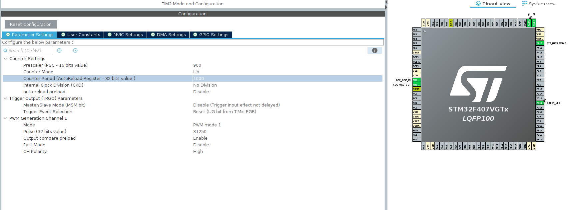

# Robotic Arm Controlled by Hand Gestures

This project showcases a robotic arm controlled by hand gestures, using x, y, z coordinates. The system is designed to demonstrate real-time computer vision and control applications in a user-friendly manner, making it an excellent addition to any professional portfolio.

## Hardware

The hardware components used in this project include:

- OAK-D Lite stereo camera for obtaining 3D coordinates
- STM32F407 Cortex-M4 development board for controlling the servos
- Three MG996R servos
- Three KY66 servos
- CH341T serial adapter module for UART USB communication

## Software

The software components consist of a Flask app for handling back-end functionalities and a React app for the user interface. The Flask app receives commands from the user interface and sends them to the STM32 development board, which in turn controls the servo motors.

### Flask App

The Flask app serves the React app and handles the following routes:

- `/`: Serves the main `index.html` file
- `/<path:path>`: Serves static files
- `/command`: Receives command data via a POST request, processes the command, and sends the appropriate serial data
- `/computer_vision_video_feed`: Provides a video feed from the computer vision module
- `/robot_arm_video_feed`: Provides a video feed from the robot arm

### React App

The React app serves as the user interface, allowing users to interact with and control the robotic arm.

## Hand Detection and Gesture Recognition

When a hand is detected in the video feed, the system recognizes the hand's gesture (either "FIST" or "FIVE") and extracts the x, y, and z coordinates of the hand. These values are then converted into angles for controlling the robotic arm's servos. The robot's base, arm, and claw movements are determined by the hand's yaw, y-coordinate, and z-coordinate, respectively. The command string is generated based on these values and sent to the STM32 development board, which moves the robotic arm accordingly.

## Setup

1. Set up and connect all hardware components
2. Run the Flask app using the command `python app.py`
3. To set up the React app, run `npm i` to install the necessary dependencies, then run `npm run build` to build the app
4. Open the React app in a browser to access the user interface

### STM 32

<b>Timer and UART Settings:</b>

## Main Components

### SystemClock_Config: Configure the system clock
<ul>
    <li>MX_GPIO_Init: Initialize GPIO pins</li>
    <li>MX_TIM2_Init: Initialize Timer 2</li>
    <li>MX_TIM3_Init: Initialize Timer 3</li>
    <li>MX_UART4_Init: Initialize UART 4</li>
</ul>

### Key Functions
<ul>
    <li>moveRobotArmJoint: Controls the movement of the robotic arm joints</li>
    <li>send_echo: Sends a message through UART</li>
</ul>

### Usage
<ol>
    <li>Compile the provided source code using STM32CubeIDE.</li>
    <li>Flash the compiled code to the STM32F4XX microcontroller.</li>
    <li>Connect the servo motors to the respective GPIO pins mentioned in the code.</li>
    <li>Power up the system and establish a UART connection to communicate with the robotic arm.</li>
    <li>Send commands in the following format: #JOINT-ANGLE,JOINT-ANGLE,...\n. Example: #BASE1-90,ARM2-45,ARM3-135\n
The robotic arm will move the joints to the specified angles.</li>
</ol>

# PWM Pin Clock Configurations

In order to achieve a timer frequency of 50Hz with a 84MHz APB1 timer clock and a 84MHz APB1 peripheral clock we do the calculation below.

Here's the calculation:

Timer frequency = APB1 timer clock / (PSC + 1) / (ARR + 1)
Timer frequency = 84,000,000 Hz / (41 + 1) / (39999 + 1) ≈ 50 Hz
Solving for PSC: PSC = 41
Solving for ARR: ARR = 39999

  
  

## Usage

1. Ensure all hardware components are connected
2. Run the Flask app
3. Access the React app's user interface
4. Move your hand in front of the OAK-D Lite stereo camera; the robotic arm will respond to your hand gestures and move accordingly

## Use Cases

This project demonstrates a range of skills and technologies, making it suitable for showcasing in a professional portfolio. Potential use cases include:

- Industrial automation
- Assistive technology for people with disabilities
- Remote-controlled devices
- Entertainment and gaming

## Technologies Used

- Flask
- OpenCV
- DepthAI
- CH341T Serial Adapter
- STM32F4 Development Board
- React

## Contributing

To contribute to this project, please submit a pull request with your proposed changes, along with a description of the changes and their intended purpose. The project maintainers will review your submission and provide feedback as necessary.
