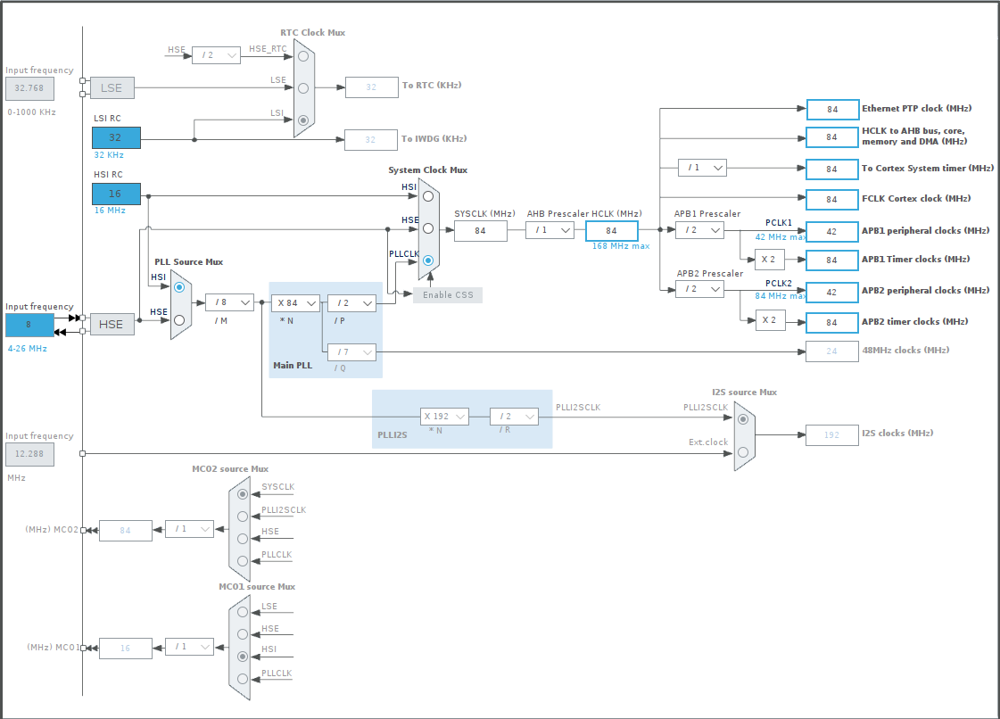
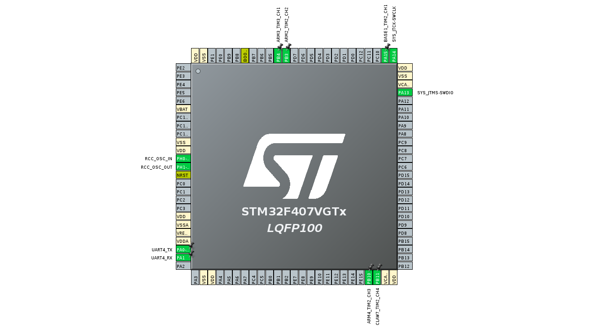
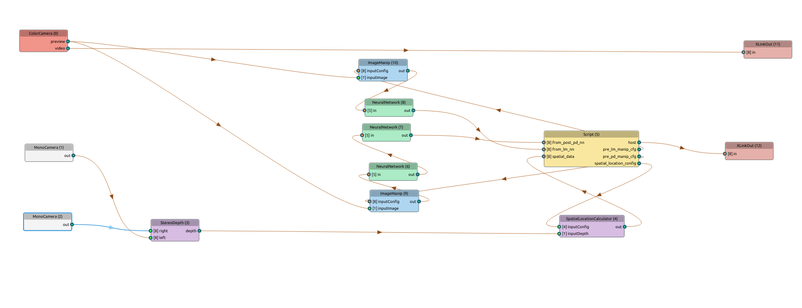

# Robotic Arm Controlled by Hand Gestures

In this end-to-end proof of concept project, I present a gesture-controlled robotic arm that leverages real-time computer vision to interpret x, y, z coordinates. 
As an integral part of my professional portfolio, this system exemplifies my skills in developing user-friendly applications for advanced computer vision and control tasks.

## Hardware

The hardware components used in this project include:

- OAK-D Lite stereo camera for obtaining 3D coordinates
- STM32F407 Cortex-M4 development board for controlling the servos
- Three MG996R servos
- Three KY66 servos
- CH341T serial adapter module for UART USB communication

## Software

The software components consist of a Flask app for handling back-end functionalities and a React app for the user interface. 
The Flask app receives commands from the user interface and sends them to the STM32 development board, which in turn controls the servo motors.

## Firmware

The firmware running on the STM32 development board plays a crucial role in translating the command string sent by the Flask app into actions performed by the robotic arm's servo motors. 
This section details the key aspects of the STM32 code and its role in the project.

<strong>
    The STM32 code is responsible for:
</strong>

<ol>
  <li>
    <strong>Serial communication</strong>: The STM32 development board receives commands from the Flask app via a serial interface. The code parses the received command strings and extracts the necessary information for controlling the servo motors.
  </li>
  <li>
    <strong>Servo motor control</strong>: The STM32 code converts the angles received from the command strings into corresponding PWM signals to control the servo motors. The code ensures smooth and accurate movement of the robotic arm's base, arm, and claw.
  </li>
  <li>
    <strong>Safety mechanisms</strong>: The firmware incorporates safety mechanisms to prevent the robotic arm from exceeding its operational limits or moving too quickly. These safeguards protect both the user and the hardware from potential damage.
  </li>
</ol>

<b>Timer And Uart Settings:</b>

### SystemClock_Config: Configure the system clock
<ul>
    <li>MX_GPIO_Init: Initialise GPIO pins</li>
    <li>MX_TIM2_Init: Initialise Timer 2</li>
    <li>MX_TIM3_Init: Initialise Timer 3</li>
    <li>MX_UART4_Init: Initialise UART 4</li>
</ul>

### Flashing the STM32 Firmware
<ol>
    <li>Compile the provided source code using STM32CubeIDE.</li>
    <li>Flash the compiled code to the STM32F4XX microcontroller.</li>
    <li>Connect the servo motors to the respective GPIO pins mentioned in the code.</li>
    <li>Power up the system and establish a UART connection to communicate with the robotic arm.</li>
    <li>Send commands in the following format: 
     
    Example: #BASE1-90,ARM2-45,ARM3-135\n 
     
    The robotic arm will move the joints to the specified angles.</li>
</ol>

# PWM Pin Clock Configurations

In order to achieve a timer frequency of 50Hz with a 84MHz APB1 timer clock and a 84MHz APB1 peripheral clock we do the calculation below.

Here's the calculation:

Timer frequency = APB1 timer clock / (PSC + 1) / (ARR + 1)
Timer frequency = 84,000,000 Hz / (41 + 1) / (39999 + 1) ≈ 50 Hz
Solving for PSC: PSC = 41
Solving for ARR: ARR = 39999

  

  

### Flask App

The Flask app serves the React app and handles the following routes:

- `/`: Serves the main `index.html` file
- `/<path:path>`: Serves static files
- `/command`: Receives command data via a POST request, processes the command, and sends the appropriate serial data
- `/computer_vision_video_feed`: Provides a video feed from the computer vision module
- `/robot_arm_video_feed`: Provides a video feed from the robot arm

### React App

The React app serves as the user interface, allowing users to interact with and control the robotic arm.

## Hand Detection and Gesture Recognition

When a hand is detected in the video feed, the system recognises the hand's gesture (either "FIST" or "FIVE") and extracts the x, y, and z coordinates of the hand. These values are then converted into angles for controlling the robotic arm's servos. The robot's base, arm, and claw movements are determined by the hand's yaw, y-coordinate, and z-coordinate, respectively. The command string is generated based on these values and sent to the STM32 development board, which moves the robotic arm accordingly.

  

<b>Computer Vision Implementation:</b>

<ol>
  <li>
    <strong>Depthai and OAK-D device:</strong> The code uses the Depthai library to interface with the OAK-D device, which is a powerful and versatile computer vision device. The pipeline is set up to utilise the OAK-D's RGB camera, stereo cameras, and depth processing capabilities.
  </li>
  <li>
    <strong>Mediapipe utilities:</strong> The code utilises a variety of utility functions from the Mediapipe library. These utilities help with tasks such as hand region detection, gesture recognition, and processing image data.
  </li>
  <li>
    <strong>Neural network models:</strong> The code incorporates several neural network models for palm detection and hand landmark estimation. These models are loaded as blob files and used in the pipeline to process the input images.
  </li>
  <li>
    <strong>Pipeline creation and node linking:</strong> The create_pipeline and link_nodes functions are responsible for creating the Depthai pipeline and linking the nodes. This process sets up the flow of data through the pipeline, connecting the input devices (such as the RGB camera and the stereo cameras) to the neural network models and the output processing.
  </li>
  <li>
    <strong>Hand data extraction:</strong> The extract_hand_data function is used to extract hand data from the output of the pipeline, including hand landmarks, rotation, and handedness. This function processes the output data and converts it into a more usable format for further analysis or visualisation.
  </li>
</ol>

## Setup

<ol>
  <li>Set up and connect all hardware components</li>
  <li>Create a Python virtual environment: <code>python -m venv venv</code></li>
  <li>Activate the virtual environment  <code>source venv/bin/activate</code>  and install dependencies: <code>python -m pip install -r requirements.txt</code></li>
  <li>Run the Flask app using the command: <code>python server.py</code></li>
  <li>To set up the React app, run <code>npm i</code> to install the necessary dependencies, then run <code>npm run build</code> to build the app</li>
  <li>Open the React app in a browser <code>http://localhost:5000</code> to access the user interface</li>
</ol>

## Usage

<ol>
  <li>Connect hardware components</li>
  <li>Launch Flask app</li>
  <li>Open React app's UI</li>
  <li>
    Interact with the OAK-D Lite camera using hand gestures:
    <ul>
      <li>x-coordinate: control base yaw</li>
      <li>y-coordinate: tilt first arm joint</li>
      <li>z-coordinate (depth): tilt third arm joint</li>
      <li>Open hand (palm): open claw</li>
      <li>Fist: close claw</li>
    </ul>
  </li>
</ol>

## Use Cases

This project demonstrates a range of skills and technologies, making it suitable for showcasing in a professional portfolio. Potential use cases include:

- Industrial automation
- Assistive technology for people with disabilities
- Remote-controlled devices
- Entertainment and gaming

## Technologies Used

- Flask
- OpenCV
- DepthAI
- CH341T Serial Adapter
- STM32F4 Development Board
- React
